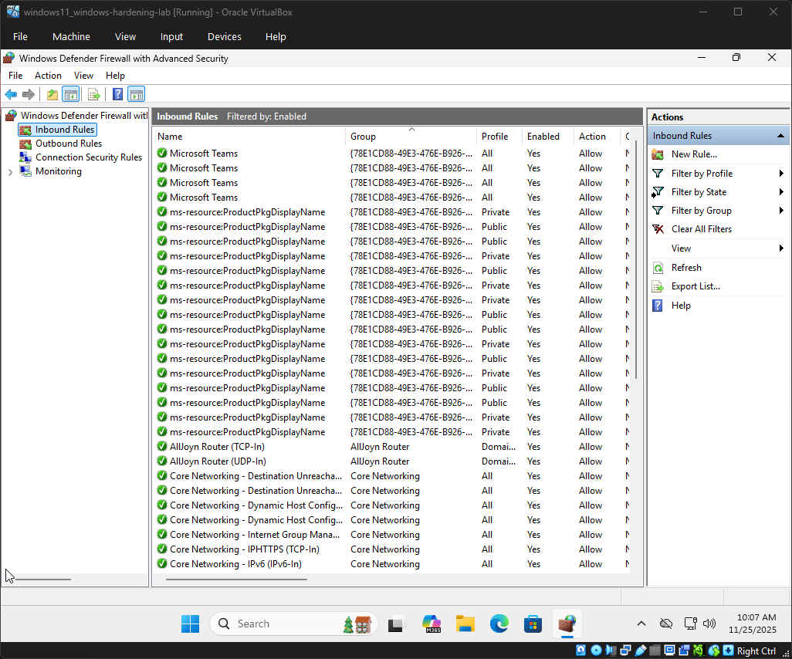
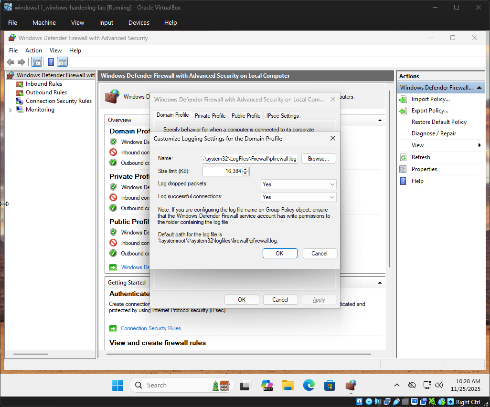
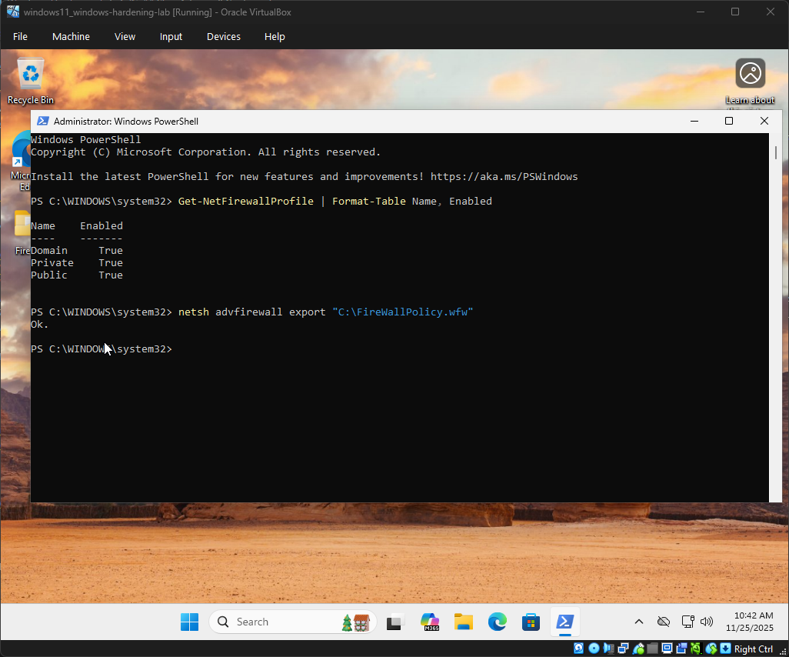
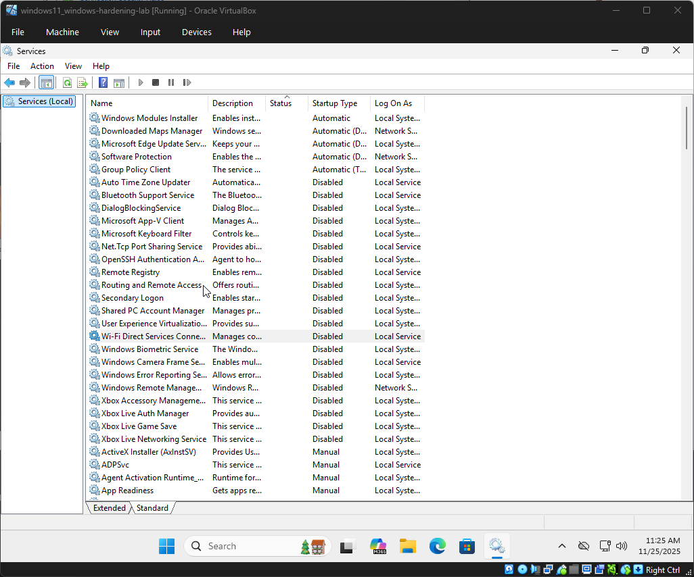
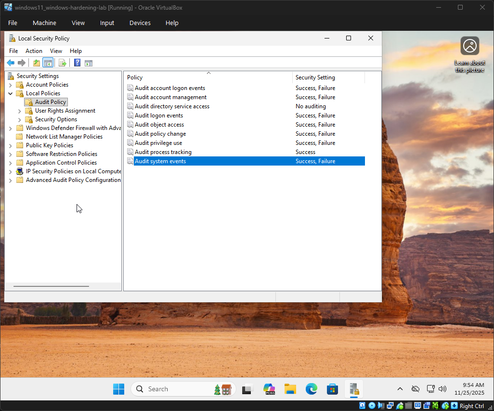
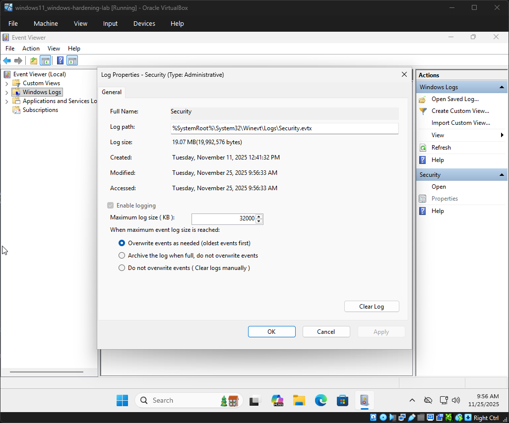
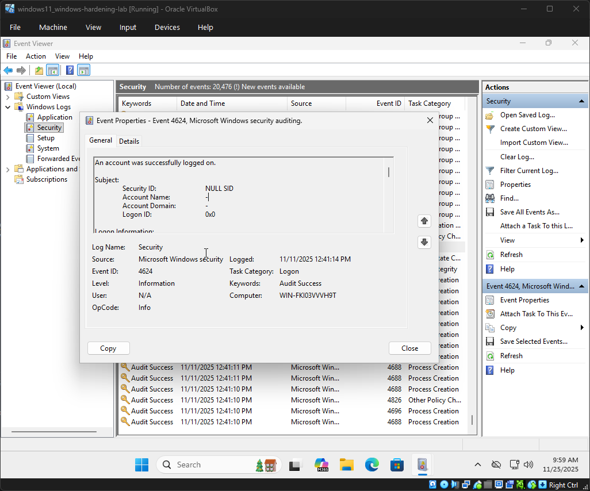

# Windows Hardening Lab

A documentation of my Windows hardening journey.  
Each step includes notes and screenshots for clarity.

---

## Table of Contents
- [Windows Hardening Lab](#windows-hardening-lab)
  - [Table of Contents](#table-of-contents)
  - [Step 1: Apply Windows Updates](#step-1-apply-windows-updates)
  - [Step 2: User Accounts](#step-2-user-accounts)
  - [Step 3: Password Policies](#step-3-password-policies)
  - [Step 4: Firewall Configuration](#step-4-firewall-configuration)
  - [Step 5: Services \& Features](#step-5-services--features)
  - [Step 6: Auditing \& Logging](#step-6-auditing--logging)
  - [Step 7: Final Review](#step-7-final-review)

---

## Step 1: Apply Windows Updates
**Goal:**  
*Establish a fully patched Windows 11 environment before applying hardening measures.*

**Actions Taken:**  
- Installed the latest version of Windows 11 Pro.
- Checked for updates in the settings menu.

**Screenshot:**  

**Notes:**  
- It's important to make sure that Windows is up to date due to the various security updates that roll out with new versions.

---

## Step 2: User Accounts
**Goal:**  
*Establish a secure account structure that enforces least privilege and prepares our Windows environment for hardening.*

**Actions Taken:**  
- Created a local administrator account ('LabAdmin') during setup.
- Added a secondary standard user account ('LabUser') through settings → Accounts → Other Users.
- Verified account types: 'LabAdmin' as Administrator, 'LabUser' as Standard User.

**Screenshot:**  

**Notes:**  
- LabAdmin (Local Administrator): Creating a dedicated admin account ensures privileged actions are performed only when necessary.
- LabUser (Standard User): Daily tasks should be performed under a non-privileged account. This enforces the principle of least privilege and prevents malware from running with admin rights.
- Auditability: Custom accounts improve logging clarity. Instead of ambiguous "Administrator" events, you'll see "LabAdmin" or "LabUser," making it easier to track activity in Event Viewer.

---

## Step 3: Password Policies
**Goal:**
*Enforce strong password requirements and account lockout policies to reduce risk of unauthorized access and brute-force attacks.*

**Actions Taken:**
- *Configured account password policy through, Security Settings -> Account Policies -> Password Policy*
  - Set minimum password length to 8
  - Enabled password complexity requirements (uppercase, lowercase, numbers, symbols).
  - Configured password history to remember 24 previous passwords.
  - Set maximum password age to 60 days.
  - Set minimum password age to 1 day.*
- *Configured account lockout policy through, Security Settings -> Account Policies -> Account Lockout Policy*
  - Threshold: 5 failed attempts
  - Duration: 15 minutes
  - Reset counter: 15 minutes

**Screenshot:**

**Notes:**
- *Minimum Length (8): Longer passwords exponentially increase brute-force difficulty while remaining user friendly.
- Complexity Requirements: Prevents weak passwords like "Password123" by requiring multiple character types.
- Password History (24): Stops using from cycling back to old passwords, ensuring each change is meaningful.
- Maximum Age (60 days): Forces periodic updates, reducing exposure if a password compromised.
- Minimum Age (1 day): Prevents immediate cycling through password to bypass history rules.
- Lockout Policy: Protects against brute-force attempts by locking accounts after repeated failures, while the reset window balances usability with security.

---

## Step 4: Firewall Configuration
**Goal:**
*Restrict inbound/outbound traffic to only what is necessary, enforce logging, and reduce attack surface.*

**Actions Taken**
- *Inbound Rule Hardening:*
  - Disabled inbound rules under: AllJoyn Router, App Installer, Cast to Device functionality, Connected Devices Platform, Delivery Optimization, Desktop App Web Viewer, DIAL protocol server, Feedback Hub, Game bar, mDNS, Microsoft Edge, Microsoft Edge WebView2 Runtime, Microsoft Media Foundation Network source, Microsoft Store, Microsoft Teams, Microsoft To Do, Network Discovery, Proximity Sharing, Solitaire Casual Games, Start Menu, Store Experience Host, Wi-Fi Direct Network Discovery, Windows Camera, Windows Feature Experience Pack, Windows Hello Face, Wireless Display.*
  - Retained core Networking rules for DHCP/DNS functionality.
  - Reviewed Windows Shell Experience rules and retained to avoid UI disruption.
- *Logging Configuration:*
  - Enabled logging for dropped packets and successful connections across Domain, Private, and Public profiles.
  -  Set log path: "C:\Windows\System32\LogFiles\Firewall\pfirewall.log
  -  Set log size limit: 16MB
- *Firewall Verification and Export:*
  - Verified Firewall is enabled for all profiles using the PowerShell command: Get-NetFireWallProfile | Format-Table Name, Enabled

**Screenshots:**
Inbound Rules Screenshot:

Firewall Log Settings Screenshot:

PowerShell FireWall Verification and Export Screenshot:

**Notes:**
- Inbound rules were reviewed and disabled based on group filtering to reduce attack surface. Consumer apps, UWP features, telemetry services, and peer-to-peer protocols were removed to align with enterprise hardening standards.
- Core networking and Windows Security rules were retained to preserve DHCP, DNS, and Defender functionality.
- Logging was enabled for dropped packets and successful connections across all profiles (Domain, Private, Public) to support auditing and troubleshooting.
- Firewall profile status was verified using PowerShell to confirm enforcement across all network types.
- Outbound connectivity was tested using `Invoke-WebRequest` to ensure HTTPS access remained functional after inbound rule changes.
- Firewall configuration was exported to `C:\FirewallPolicy.wfw` for backup and rollback purposes.
- All changes were documented with screenshots showing rule filtering, logging settings, profile status, connectivity tests, and export confirmation.

---

## Step 5: Services & Features
**Goal:**
*Reduce the system’s attack surface by disabling unnecessary, legacy, and consumer-oriented services while retaining critical ones required for security and connectivity. This ensures the hardened system runs only essential background processes.*

**Actions Taken:**
- Opened 'services.msc' and reviewed all running services.
- Disabled unnecessary or high-risk services by setting **Startup type = Disabled** and stopping them where applicable:
  - Remote Registry
  - Fax
  - Xbox Services (Auth Manager, Game Save, Networking)
  - Print Spooler (no printing required)
  - Secondary Logon
  - Windows Error Reporting Service
  - Windows Remote Management (WS-Management) [disabled unless explicitly needed]
  - Windows Biometric Service
  - Windows Camera Frame Server
  - AllJoyn Router Service
  - Connected Devices Platform Service
  - Peer Name Resolution Protocol / Peer Networking Grouping
  - SSDP Discovery / UPnP Device Host
  - Wi-Fi Direct Services Connection Manager
- Retained critical services with **Startup type = Automatic**:
  - Windows Defender Antivirus Service
  - Windows Firewall Service
  - Windows Update Service
  - DHCP Client
  - DNS Client
  - Core Networking Services

**Screenshot:**
Disabled Services Screenshot:

**Notes:**
- Disabling legacy, consumer, and peer-to-peer services reduces attack surface.
- Critical services were retained to preserve system functionality, security, and connectivity.

---

## Step 6: Auditing & Logging
**Goal:**
*Establish an effective auditing and logging baseline to monitor system activity, detect unauthorized access, and support forensic investigations.

**Actions Taken:**
- Opened Local Security Policy ('secpol.msc') and enabled audit policies:
  - Account logon events (Success, Failure)
  - Logon events (Success, Failure)
  - Object access (Success, Failure)
  - Process tracking (Success)
  - Privilege use (Success, Failure)
  - Policy change (Success, Failure)
  - Account management (Success, Failure)
  - System events (Success, Failure)
- Configured log retention in event viewer. ('eventvwr.msc')
  - Security log size set to 32 MB
  - Retention method set to overwrite events as needed
- Verified logging activity by reviewing Security log entries in Event Viewer.

**Screenshots:**
Security Policy Settings Screenshot:

Security Log Properties:

Successful Log Screenshot:

**Notes:**
- Audit policies were enabled to track authentication, access attempts, privilege use, and system changes.
- Security log retention was configured to preserve historical data for forensic review and incident response.
- Event Viewer confirmed that audit events (e.g., Event ID 4624 for successful logon) are actively being recorded.
- Logging configuration supports accountability and visibility across user actions and system-level events.
- Optional advanced audit categories were reviewed for finer granularity, aligning with enterprise-grade monitoring.
- Screenshot evidence includes policy settings, log configuration, and sample audit events for verification.

## Step 7: Final Review
**Goal:**
*Verify that all hardening steps were successfully applied, confirm system stability and functionality, and ensure documentation is complete with reproducible evidence.*

**Actions Taken:**
- Rebooted system to apply all changes.
- Validated system functionality (networking, Defender, updates)
- Spot-checked key areas:
  - Firewall rules
  - Disabled services
  - Windows features status
  - Audit logs
  - User account settings
- Reviewed README entries for completeness and clarity.
- Verified screenshot evidence for each step.

**Notes:**
- System is fully hardened according to the scope of the lab.
- All changes were verified through GUI and PowerShell outputs.

---