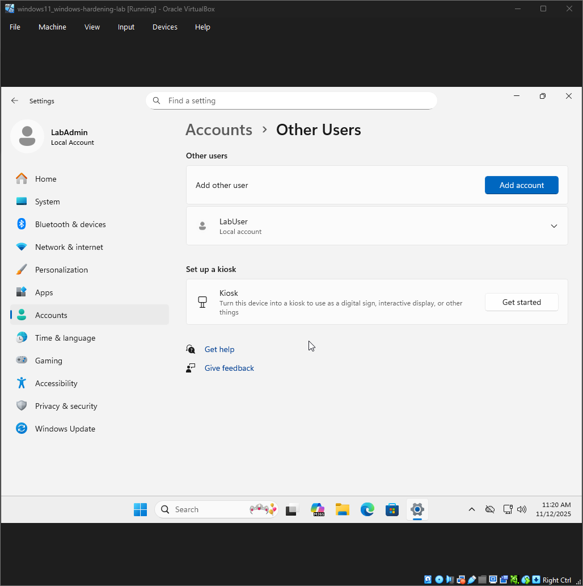
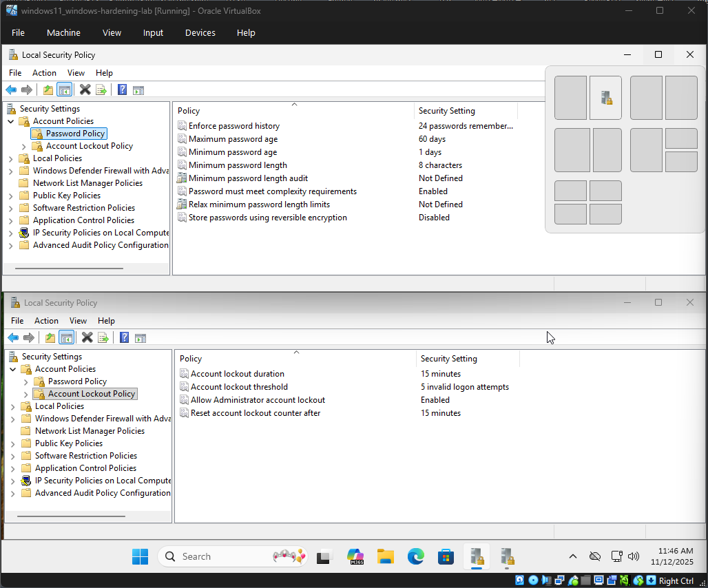

# 🛡️ Windows Hardening Lab

A documentation of my Windows hardening journey.  
Each step includes notes and screenshots for clarity.

---

## 📋 Table of Contents
- [🛡️ Windows Hardening Lab](#️-windows-hardening-lab)
  - [📋 Table of Contents](#-table-of-contents)
  - [Step 1: Apply Windows Updates](#step-1-apply-windows-updates)
  - [Step 2: User Accounts](#step-2-user-accounts)
  - [Step 3: Password Policies](#step-3-password-policies)
  - [Step 4: Firewall Configuration](#step-4-firewall-configuration)
  - [Step 5: Services \& Features](#step-5-services--features)
  - [Step 6: Auditing \& Logging](#step-6-auditing--logging)
  - [Step 7: Final Review](#step-7-final-review)

---

## Step 1: Apply Windows Updates
**Goal:**  
*Establish a fully patched Windows 11 environment before applying hardening measurees.*

**Actions Taken:**  
- *Installed the latest version of Windows 11 Pro.*
- *Checked for updates in the settings menu.*

**Screenshot:**  

**Notes:**  
- *Its important to make sure that Windows is up to date due to the various security updates that roll out with new versions.*

---

## Step 2: User Accounts
**Goal:**  
*Establish a secure account structure that enforces least privelage and prepares our Windows environment for hardening.*

**Actions Taken:**  
- *Created a local administrator account ('LabAdmin') during setup.*
- *Added a secondary standard user account ('LabUser') through settings → Accounts → Other Users.*
- *Verified account types: 'LabAdmin' as Administrator, 'LabUser' as Standard User.*

**Screenshot:**  

**Notes:**  
- *LabAdmin (Local Administrator): Creating a dedicated admin account ensures privileged actions are performed only when necessary.*
- *LabUser (Standard User): Daily tasks should be performed under a non-privileged account. This enforces the principle of least privilege and prevents malaware from running with admin rights.*
- *Aduitability: Custom accounts improve logging clarity. Instead of ambiguous "Administrator" events, you'll see "LabAdmin" or "LabUser," making it easier to track activity in Event Viewer.*

---

## Step 3: Password Policies
**Goal:**
*Enforce strong password requirements and account lockout policies to reduce risk of unauthorized access and brute-force attacks.*

**Actions Taken**
- *Configured account password policy through, Security Settings -> Account Policies -> Password Policy*
  - *Set minimum password length to 8*
  - *Enabled password complexity requirements (uppercase, lowercase, numbers, symbols).*
  - *Configured password history to remember 24 previous passwords.*
  - *Set maximum password age to 60 days.*
  - *Set minumum passowrd age to 1 day.*
- *Configured account lockout policy through, Security Settings -> Account Policies -> Account Lockout Policy*
  - *Threshold: 5 failed attempts*
  - *Duration: 15 minutes*
  - *Reset counter: 15 minutes*

**Screenshot:**

**Notes:**
- *Minimum Length (8): Longer passwords exponentially increase brute-force difficulty while remaining user friendly.*
- *Complexity Requirements: Prevents weak passwords like "Password123" by requiring multiple character types.*
- *Password History (24): Stops using from cycling back to old passwords, ensuring each change is meaningful.*
- *Maximimum Age (60 days): Forces periodic updates, reducing exposure if a password comprimisued.*
- *Miniumum Age (1 day): Prevents immediate cycling through passwor dto bypass history rules.*
- *Lockout Policy: Protects against brute-force attempts by locking accounts after repeated failures, while the reset window balances usability with security.*

---

## Step 4: Firewall Configuration
*(Repeat structure)*

---

## Step 5: Services & Features
*(Repeat structure)*

---

## Step 6: Auditing & Logging
*(Repeat structure)*

---

## Step 7: Final Review
*(Repeat structure)*

