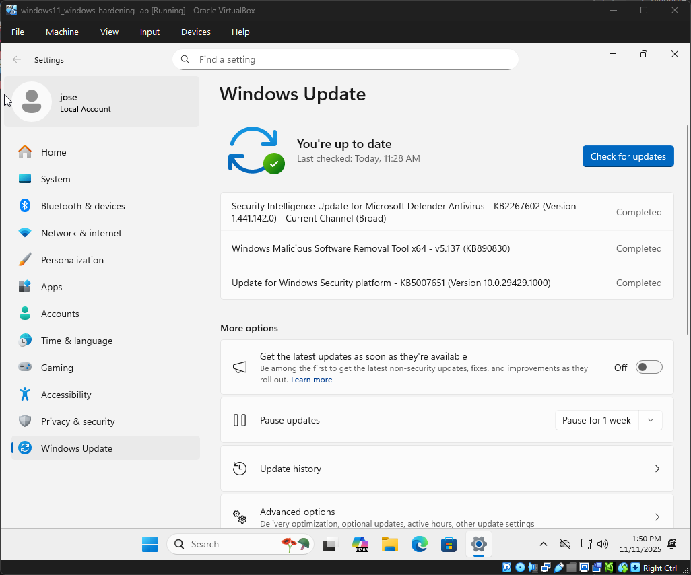

<<<<<<< HEAD

=======
# 🛡️ Windows Hardening Lab

A documentation of my Windows hardening journey.  
Each step includes notes and screenshots for clarity.

---

## 📋 Table of Contents
- [🛡️ Windows Hardening Lab](#️-windows-hardening-lab)
  - [📋 Table of Contents](#-table-of-contents)
  - [Step 1: Apply Windows Updates](#step-1-apply-windows-updates)
  - [Step 2: User Accounts](#step-2-user-accounts)
  - [Step 3: Password Policies](#step-3-password-policies)
  - [Step 4: Firewall Configuration](#step-4-firewall-configuration)
  - [Step 5: Services \& Features](#step-5-services--features)
  - [Step 6: Auditing \& Logging](#step-6-auditing--logging)
  - [Step 7: Final Review](#step-7-final-review)

---

## Step 1: Apply Windows Updates
**Goal:**  
*Establish a fully patched Windows 11 environment before applying hardening measurees.*

**Actions Taken:**  
- *Installed the latest version of Windows 11 Pro.*
- *Checked for updates in the settings menu.*

**Screenshot:**  

**Notes:**  
*Its important to make sure that Windows is up to date due to the various security updates that roll out with new versions.*

---

## Step 2: User Accounts
**Goal:**  
*Establish a secure account structure that enforces least privelage and prepares our Windows environment for hardening.*

**Actions Taken:**  
- *Created a local administrator account ('LabAdmin') during setup.*
- *Added a secondary standard user account ('LabUser') through settings → Accounts → Other Users. 
- *Verified account types: 'LabAdmin' as Administrator, 'LabUser' as Standard User.

**Screenshot:**  
``

**Notes:**  
*(Your notes here)*

---

## Step 3: Password Policies
*(Repeat the same structure: Goal → Actions → Screenshot → Notes)*

---

## Step 4: Firewall Configuration
*(Repeat structure)*

---

## Step 5: Services & Features
*(Repeat structure)*

---

## Step 6: Auditing & Logging
*(Repeat structure)*

---

## Step 7: Final Review
*(Repeat structure)*
>>>>>>> eb87724 (Fix case: rename readme.md to README.md and update content)
